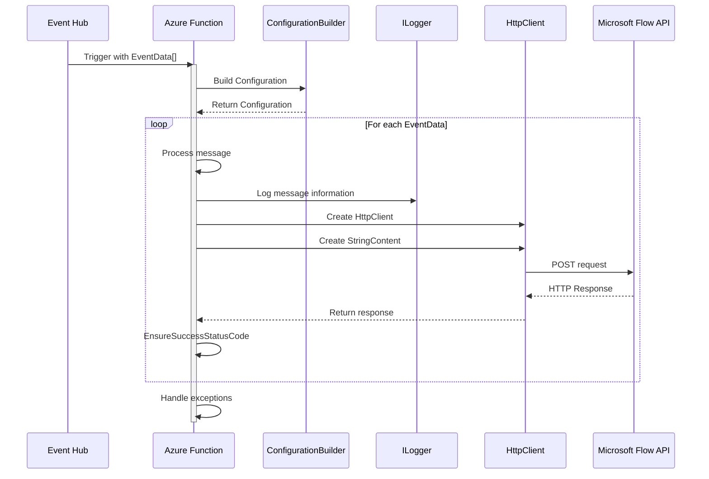
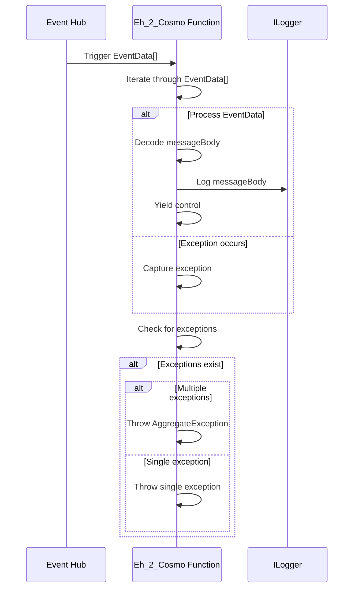
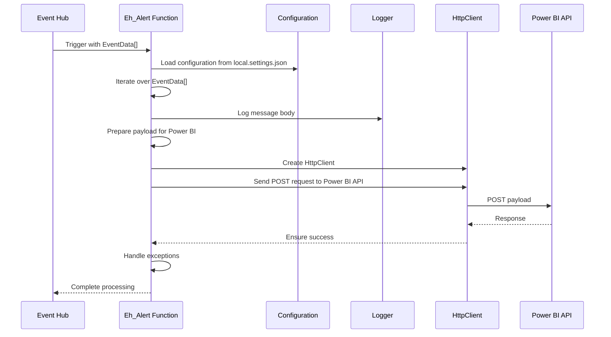
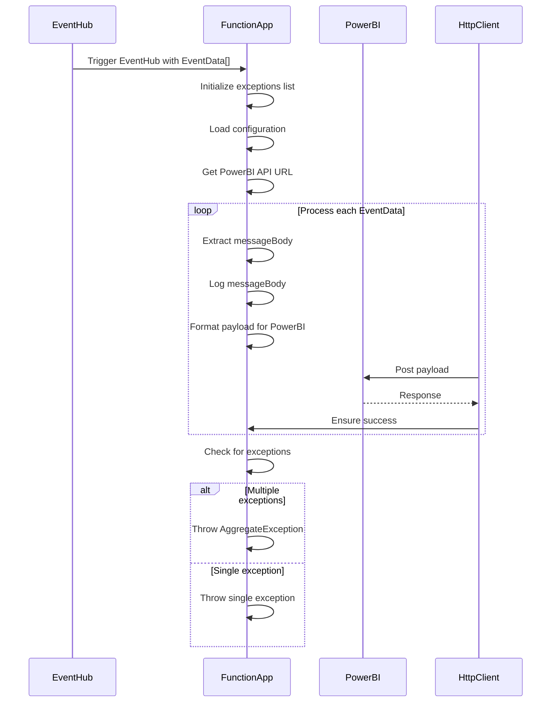
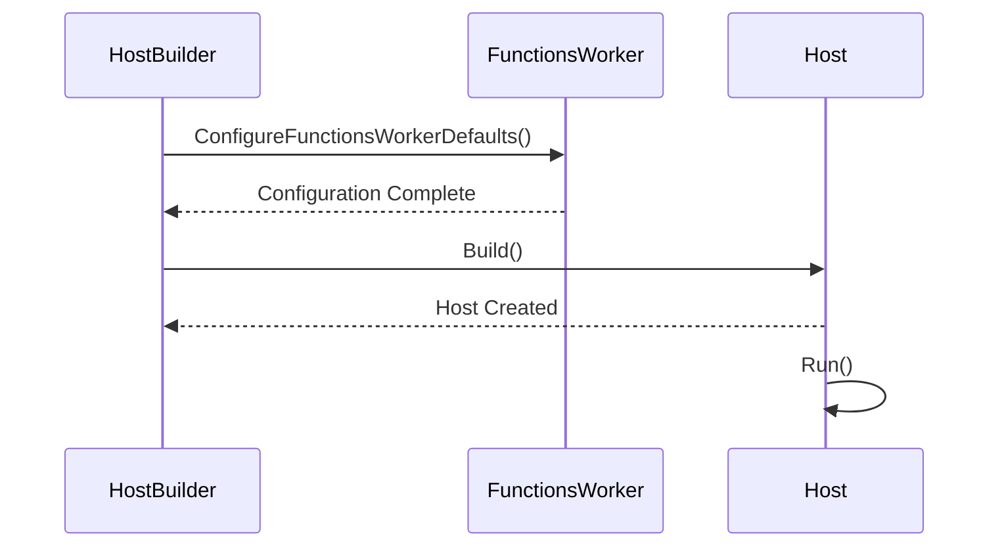

# Sequence Diagrams
## Eventhub_Flow_Notification.cs

***
## h_2_Cosmo.cs 

***
## Eh_Alert.cs

***
## Eventhub_Built_in_IoTHub.cs

***
## Program.cs
This diagram shows the sequence of actions when the program starts. The HostBuilder is configured with FunctionsWorker defaults, then it builds a Host. The Host is then run.

***